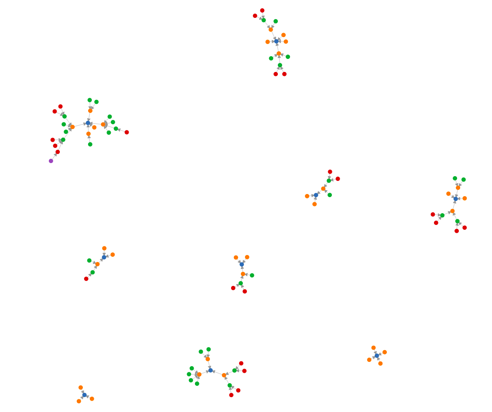

# Visualization

This repository visualizes the multiplicative persistence.
Inspired by this Numberphile video: [YouYube Numberphile](https://www.youtube.com/watch?v=Wim9WJeDTHQ&feature=youtu.be&fbclid=IwAR07tiGLYsmdzmFKYFJBKzdVQnYowwfR5VM9eFrJaZhTPEYalMFJvRLIog8) 

