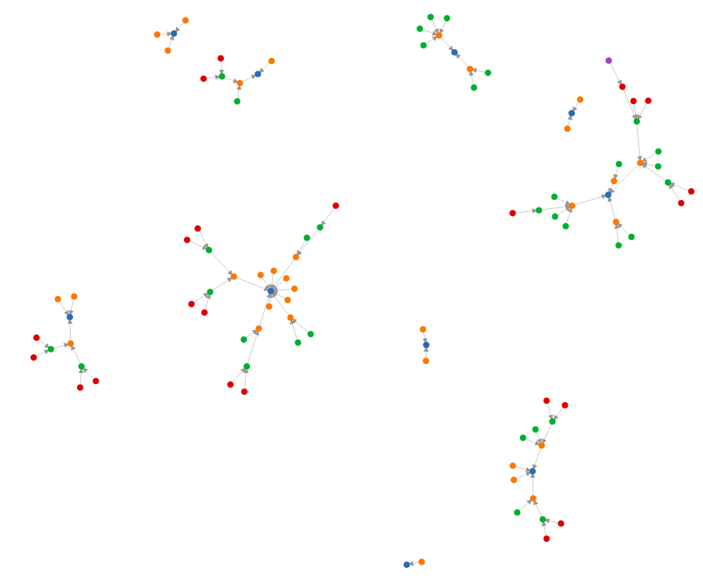

# Visualization

This repository visualizes the multiplicative persistence.
Inspired by this Numberphile video: [YouYube Numberphile](https://www.youtube.com/watch?v=Wim9WJeDTHQ&feature=youtu.be&fbclid=IwAR07tiGLYsmdzmFKYFJBKzdVQnYowwfR5VM9eFrJaZhTPEYalMFJvRLIog8) 

The [visualization](https://wikunia.github.io/Persistence/) shows the persistence graph for the numbers up to 100.
Color indicates the number of steps and the connection shows the next step. You can hover over a node to see the number and the path it takes.

The code used for creating the graph can be found in: `persistence.jl` and can be called with `create_bf_list()` which creates the `graph.json`.